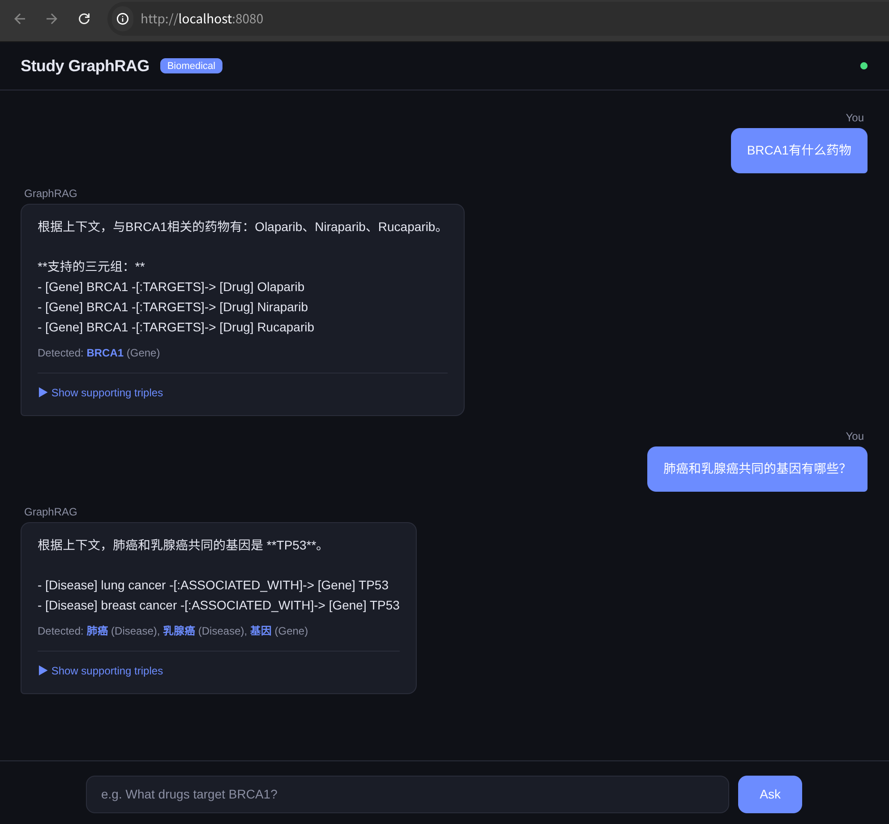

# Study GraphRAG

> A learning-oriented implementation of **Graph-based Retrieval-Augmented Generation (GraphRAG)** for the **biomedical domain**, using **Neo4j** as the graph database.

This project is designed as a study vehicle to understand how graph structures improve over naive vector-only RAG by capturing entity relationships and enabling multi-hop reasoning over biomedical knowledge.

## Features

- **Biomedical data model** -- Genes, proteins, drugs, diseases, pathways, articles, and Event nodes with typed relationships
- **LLM-based extraction** -- Extract entities and relationships (binary + n-ary) from unstructured text
- **Provenance tracking** -- Every relationship records its source document (``pmid``), enabling evidence traceback
- **N-ary (hyper) relations** -- Multi-participant relationships reified as ``:Event`` nodes for complex biomedical statements
- **Hybrid retrieval** -- Combine dense vector search (Sentence-Transformers) with graph traversal (Cypher)
- **Grounded generation** -- LLM answers cite retrieved triples with provenance and evidence
- **Neo4j native** -- Uniqueness constraints, vector index, and Cypher-powered graph traversal

## Quick Start

```bash
# 1. Start Neo4j
docker compose up -d

# 2. Install
python -m venv .venv && source .venv/bin/activate
pip install -e .
cp .env.example .env   # Edit: set LLM_API_KEY

# 3. Ingest sample data
python scripts/ingest.py --input data/sample_articles.jsonl

# 4. Query
python scripts/query.py --question "What drugs target BRCA1?"
```

For detailed documentation, see [docs/index.md](docs/index.md).

---

## Testing Provenance & N-ary Features

Ingest the dedicated demo data (includes n-ary scenarios) and try provenance-aware queries:

```bash
# 1. Clear and rebuild Neo4j database
docker compose down -v && docker compose up -d

# 2. Ingest demo articles
python scripts/ingest.py --input data/demo_articles.jsonl

# 3a. Provenance query -- ask about a specific source document
python scripts/query.py \
  --question "What relations are found in pmid-45678901?" \
  --show-context

# 3b. N-ary (Event) query -- multi-participant relationships
python scripts/query.py \
  --question "What events involve Imatinib?" \
  --show-context

# 3c. Cross-document comparison
python scripts/query.py \
  --question "Which documents mention the relationship between BRCA1 and Olaparib?"
```

Use ``--show-context`` to inspect the provenance-annotated triples and ``[Event]`` blocks.

## Screenshot



## Architecture

```
User Question
    │
    ├── (PMID detected?) ──► get_relations_by_source(pmid)
    │
    ▼
┌─────────────────┐
│  Entity Linking │── Extract entities from question (LLM)
└────────┬────────┘
         ▼
┌─────────────────┐
│  Vector Search  │── Embed question, find similar entities
└────────┬────────┘
         ▼
┌──────────────────────────┐
│  Graph Expansion         │
│  ├─ expand_with_relations│── Binary edges + pmid
│  └─ expand_entity_events │── Event nodes + participants
└──────────┬───────────────┘
           ▼
┌─────────────────┐
│ Context Assembly│── Provenance-annotated triples
└────────┬────────┘
         ▼
┌─────────────────┐
│ LLM Generation  │── Answer grounded in evidence
└─────────────────┘
```

## Data Model

| Node Label | Examples | Key Relations |
|---|---|---|
| `Gene` | BRCA1, TP53, EGFR | ENCODES, ASSOCIATED_WITH, TARGETS |
| `Protein` | p53, BRCA1 protein | INTERACTS_WITH, REGULATES, TARGETS |
| `Drug` | Olaparib, Gefitinib | TARGETS, INDICATED_FOR |
| `Disease` | Breast Cancer, NSCLC | ASSOCIATED_WITH, INDICATED_FOR |
| `Pathway` | PI3K/AKT, RAS/RAF | PARTICIPATES_IN |
| `Event` | (reified n-ary relation) | PARTICIPATES_IN (from entities), MENTIONED_IN (to Article) |
| `Article` | PMIDs | MENTIONED_IN (from entities & events) |

## Project Structure

```
src/study_graphrag/
├── config.py               # Environment configuration
├── graph/                  # Neo4j client + data models
├── ingestion/              # LLM entity/relation extraction pipeline
├── retrieval/              # Hybrid vector + graph search
└── generation/             # LLM answer generation
scripts/                    # CLI entry points
docs/                       # Full documentation
```

See [docs/index.md](docs/index.md) for the complete project structure.

## Configuration

All settings via environment variables (`.env` file):

| Variable | Default | Description |
|---|---|---|
| `NEO4J_URI` | `bolt://localhost:7687` | Neo4j connection |
| `LLM_MODEL` | `deepseek-chat` | LLM for extraction/generation |
| `LLM_API_KEY` | (required) | API key (DeepSeek, OpenAI, etc.) |
| `LLM_BASE_URL` | `https://api.deepseek.com` | API base URL |

## Documentation

| Document | Description |
|---|---|
| [Scope & Goals](docs/scope-and-goals.md) | Project scope, goals, non-goals, tech stack |
| [Architecture](docs/architecture.md) | Layer design, data flow, key decisions |
| [Data Model](docs/data-model.md) | Nodes, relations, constraints, indexes |
| [Ingestion Guide](docs/ingestion-guide.md) | How to ingest text into Neo4j |
| [Query Guide](docs/query-guide.md) | How to query and get answers |
| [Examples](docs/examples.md) | Provenance queries, binary & n-ary relation examples |

## License

MIT
